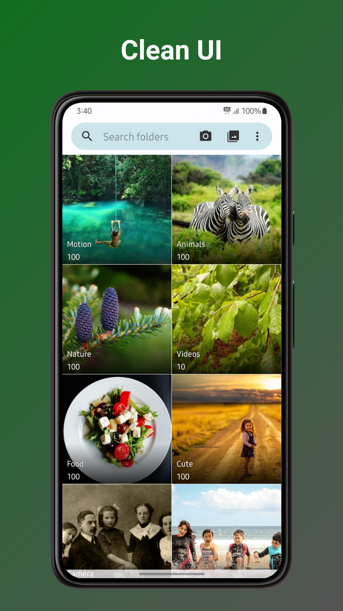
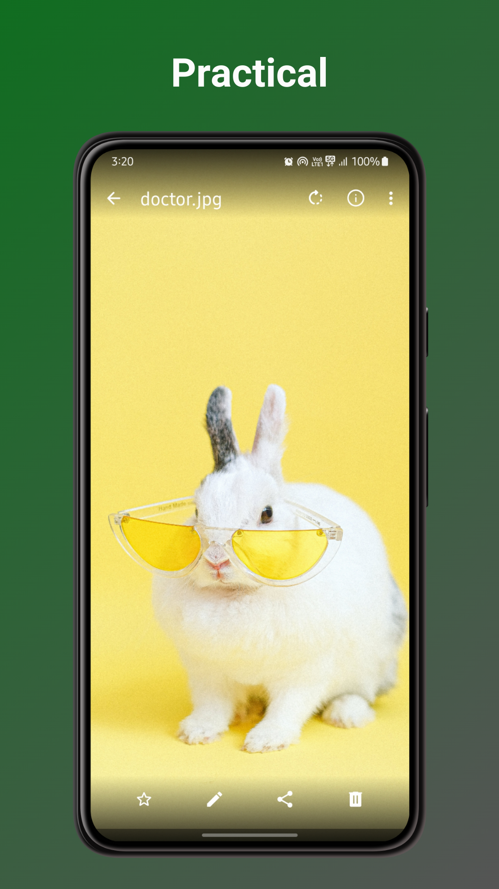
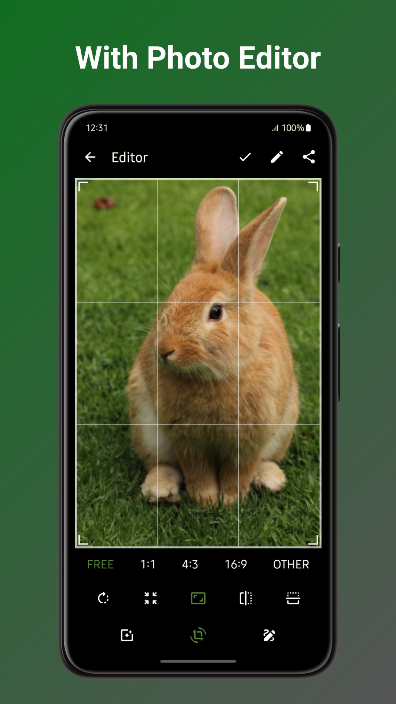

# Cloud Gallery


Cloud Gallery is an open-source Android photo and video gallery with integrated cloud storage support. It combines a fast local gallery experience with optional backup and metadata management through Cloud Gallery services and Alibaba Cloud OSS.

## Cloud Storage

- Upload photos and videos directly from the gallery to Alibaba Cloud OSS.
- Skip duplicate transfers with MD5-based file detection and instant upload.
- Track upload progress, cancel active uploads, and clear completed tasks.
- See cloud upload status alongside local photos and filter for files that have not been uploaded.
- Manage cloud titles, favorites, and stored photo properties.
- Delete a photo's cloud record without deleting the local file.
- Import account configuration by pasting a configuration string or scanning a QR code.
- Scan a QR code from the Android app to authorize a Cloud Gallery Web login.

Cloud features require an account configured through the Cloud Gallery service. The Android app remains usable as a local gallery without signing in.

## Local Gallery

- Browse photos and videos by folders or media groups.
- View, crop, resize, rotate, flip, draw on, and filter images.
- Play videos with gesture and playback-speed controls.
- Mark favorites, search media, manage hidden or excluded folders, and restore files from the recycle bin.
- Customize themes, colors, layouts, sorting, and visible actions.
- View common image, video, RAW, SVG, GIF, AVIF, and JPEG XL formats.

## Build

Requirements:

- Android SDK
- JDK 17

Build a debug APK:

```bash
./gradlew assembleFossDebug
```

Run static checks:

```bash
./gradlew detekt
./gradlew lintDebug
```

## Source Of Truth

This repository is a read-only public mirror of the Android client. Development happens in the private Cloud Gallery repository, and accepted changes are synchronized here automatically.

## License

Cloud Gallery is distributed under the terms of the [LICENSE](LICENSE) file.

## Screenshots

<div align="center">



</div>
